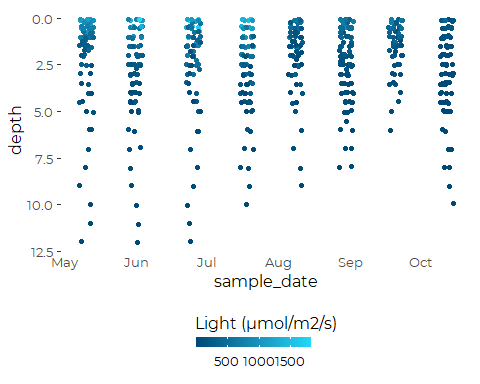

Initial Review of DEP Irradiance Data
================
Curtis C. Bohlen, Casco Bay Estuary Partnership.
04/26/2021

-   [Introduction](#introduction)
-   [Load Data](#load-data)
-   [Summary of Metadata](#summary-of-metadata)
    -   [QA/QC Samples](#qaqc-samples)
    -   [Censoring Flags](#censoring-flags)
    -   [Units](#units)
-   [Review of Irradiance Data](#review-of-irradiance-data)
    -   [Scatterplot Matrix (Pairs
        Plot)](#scatterplot-matrix-pairs-plot)
    -   [Sites by Depths (Useless?)](#sites-by-depths-useless)
    -   [How often was each site
        sampled?](#how-often-was-each-site-sampled)
-   [Mean K by Site](#mean-k-by-site)
-   [“Adjusted” Mean K by Site](#adjusted-mean-k-by-site)
-   [Compare Results](#compare-results)


# Introduction

Review of irradiance data and calculation of light attenuation
coefficients. (k values.)

Light attenuation is often measured as
*I*<sub>*d*</sub> = *I*<sub>0</sub>*e*<sup> − *k**z*</sup>
Where *z* is depth.

$$
\\frac{I\_d}{I\_0} = e^{-kz}
$$

$$
log(\\frac{I\_d}{I\_0}) = -kz
$$

Note that this produces a value of k at each depth If we assume theory
is accurate and light attenuation is vertically uniform, we can average
across depths. to improve accuracy.

$$ k = \\frac{1}{-z} \\times log(\\frac{I\_d}{I\_0}) $$

Where we recast values as percentages of surface light, we can estimate
k\~d as

$$ k \\approx - \\frac{log(I\_d)}{z}$$

We want to recast that as a linear regression problem.

Y = mx + b

log(Id) = -kz

So, K can be estimated as the negative of linear coefficient of depth in
a linear model.

\#Load libraries

``` r
#library(readxl)
library(tidyverse)
#> Warning: package 'tidyverse' was built under R version 4.0.5
#> -- Attaching packages --------------------------------------- tidyverse 1.3.1 --
#> v ggplot2 3.3.3     v purrr   0.3.4
#> v tibble  3.1.1     v dplyr   1.0.5
#> v tidyr   1.1.3     v stringr 1.4.0
#> v readr   1.4.0     v forcats 0.5.1
#> Warning: package 'tibble' was built under R version 4.0.5
#> Warning: package 'tidyr' was built under R version 4.0.5
#> Warning: package 'dplyr' was built under R version 4.0.5
#> Warning: package 'forcats' was built under R version 4.0.5
#> -- Conflicts ------------------------------------------ tidyverse_conflicts() --
#> x dplyr::filter() masks stats::filter()
#> x dplyr::lag()    masks stats::lag()

library(GGally)
#> Warning: package 'GGally' was built under R version 4.0.5
#> Registered S3 method overwritten by 'GGally':
#>   method from   
#>   +.gg   ggplot2
library(emmeans)
#> 
#> Attaching package: 'emmeans'
#> The following object is masked from 'package:GGally':
#> 
#>     pigs
#library(mgcv)

library(CBEPgraphics)
load_cbep_fonts()
theme_set(theme_cbep())
```

# Load Data

``` r
irr_data <- read_csv(file.path('dep_irradiance_data.csv')) %>%
              rename(sample_date = dt)
#> 
#> -- Column specification --------------------------------------------------------
#> cols(
#>   site_name = col_character(),
#>   site = col_character(),
#>   dt = col_date(format = ""),
#>   month = col_character(),
#>   year = col_double(),
#>   time = col_time(format = ""),
#>   hour = col_double(),
#>   depth = col_double(),
#>   irr_air = col_double(),
#>   irr_water = col_double(),
#>   irr_pct = col_double()
#> )
```

# Summary of Metadata

## QA/QC Samples

We conducted no analysis of QA/QC samples, and simply deleted then from
the data to avoid confusion.

## Censoring Flags

While preparing our working data, we separated raw observations from
text annotations, including data quality flags. IN the sonde-related
data, we only had to contend with (1) left censoring of turbidity data ,
and (2) data quality flags on all chlorophyll data.

Since all sonde-related chlorophyll data was flagged as of questionable
accuracy (with “J” flags), it does us no good to track that information
during further analysis. We retain all data, but recognize that it’s
accuracy is suspect, especially in comparison to laboratory results.

We also had a few “U&lt;” flags in the Turbidity data. We separated out
a `TRUE` / `FALSE` flag to indicated censored values, with the name
’turbidity\_cens\`.

## Units

Our derived data files lack any indication of units. Units were
documented in the source Excel files. We summarize relevant information
here.

| Variable Name | Meaning                                         | Units                       |
|---------------|-------------------------------------------------|-----------------------------|
| site\_name    | DEP “Site ID”                                   |                             |
| site          | DEP “Sample Point ID” without depth designation |                             |
| sample\_date  | Date of sample collection                       | yyyy-mm-dd format           |
| month         | Month, derived from date                        | Three letter codes          |
| year          | Year, derived from date                         |                             |
| time          | time of sample                                  | 24 hour clock, hh:mm format |
| hour          | hour, derived from time                         |                             |
| depth         | Sample Depth                                    | Meters                      |
| irr\_air      | Irradiance (air)                                | µmol/m2/s                   |
| irr\_water    | Irradiance (surface water)                      | µmol/m2/s                   |
| irr\_pct\_    | Irradiance (% of air in surface water)          | %                           |

# Review of Irradiance Data

## Scatterplot Matrix (Pairs Plot)

``` r
tmp <- irr_data %>%
  select(irr_air:irr_pct)
ggpairs(log(tmp), progress = FALSE)
#> Warning: Removed 157 rows containing non-finite values (stat_density).
#> Warning in ggally_statistic(data = data, mapping = mapping, na.rm = na.rm, :
#> Removed 157 rows containing missing values

#> Warning in ggally_statistic(data = data, mapping = mapping, na.rm = na.rm, :
#> Removed 157 rows containing missing values
#> Warning: Removed 157 rows containing missing values (geom_point).

#> Warning: Removed 157 rows containing missing values (geom_point).
```


Note skewed data distributions, even for the percentage values.

## Sites by Depths (Useless?)

``` r
tmp <- irr_data %>%
  mutate(dpth_clss = if_else(depth < 2, round(depth, 1), round(depth,0)))
xtabs(~ dpth_clss + site, data = tmp)
#>          site
#> dpth_clss BMR02 CBPR CR-31 CR-44 EEB18 FR03 FR04 FR05A FR05B FR07 FR09 HR02
#>       0       0    0     0     0     0    0    0     0     0    0    0    0
#>       0.1    20   25     5     3    23    4    4     1     2    3   25    3
#>       0.2     8   14     3     3    16    0    0     0     1    0    4    2
#>       0.3     1    2     0     0     2    0    0     0     0    0    1    0
#>       0.4     0    2     0     0     0    0    0     0     0    0    1    0
#>       0.5    27   28     5     3    27    4    4     1     2    3   28    3
#>       0.6     1    1     0     0     1    0    0     0     0    0    1    0
#>       0.7     0    0     0     0     1    0    0     0     0    0    0    0
#>       0.8     4   12     3     3    15    0    0     0     1    0    1    2
#>       0.9     0    0     0     0     1    0    0     0     0    0    0    0
#>       1      28   28     5     3    27    4    4     1     2    3   29    3
#>       1.1     0    0     0     0     0    0    0     0     0    0    1    0
#>       1.2     4    7     2     3    14    0    0     0     2    0    0    2
#>       1.3     0    1     0     0     2    0    0     0     0    0    0    0
#>       1.4     0    0     0     0     1    0    0     0     0    0    0    0
#>       1.5    27   22     4     3    26    4    4     1     1    3   24    3
#>       1.6     0    1     0     0     0    0    0     0     0    0    0    0
#>       1.7     0    1     0     0     1    0    0     0     0    0    0    0
#>       1.8     4    2     1     2    12    0    0     0     1    0    0    2
#>       2      47   41     7     1    36    8    8     2     3    6   54    7
#>       3      29   20     3     0     7    4    4     1     0    3   30    0
#>       4      34    5     5     0     3   11   11     3     0    8   78    0
#>       5       3    0     0     0     0    1    4     1     0    3   30    0
#>       6       0    0     0     0     0    0    4     1     0    3   28    0
#>       7       0    0     0     0     0    0    4     1     0    3   25    0
#>       8       0    0     0     0     0    0    3     1     0    2   24    0
#>       9       0    0     0     0     0    0    1     0     0    1   17    0
#>       10      0    0     0     0     0    0    0     0     0    1   11    0
#>       11      0    0     0     0     0    0    0     0     0    1    3    0
#>       12      0    0     0     0     0    0    0     0     0    0    3    0
#>       13      0    0     0     0     0    0    0     0     0    0    0    0
#>          site
#> dpth_clss HR03 HR04 HR05 LC02 P6FGG P7CBI PR-17 PR-28 PRV70 RR-01 RR-06 RR-13
#>       0      0    0    0    0     0     0     1     0     1     0     0     0
#>       0.1    3    3    3    4    17    18    19    23    20     5     7     7
#>       0.2    0    0    0    0     1     2    10     4     5     3     2     2
#>       0.3    0    0    0    0     0     0     3     2     3     0     0     0
#>       0.4    0    0    0    0     0     0     0     0     0     0     0     0
#>       0.5    3    3    3    4    18    18    24    30    26     5     7     7
#>       0.6    0    0    0    0     0     0     0     0     0     0     0     0
#>       0.7    0    0    0    0     0     0     0     0     0     0     0     0
#>       0.8    0    0    0    0     0     1    10     1     2     3     1     2
#>       0.9    0    0    0    0     0     0     0     1     0     0     0     0
#>       1      3    3    3    4    18    18    24    29    25     5     7     7
#>       1.1    0    0    0    0     0     0     0     0     0     0     0     0
#>       1.2    0    0    0    0     0     1    10     0     2     2     1     1
#>       1.3    0    0    0    0     0     0     0     0     0     0     0     0
#>       1.4    0    0    0    0     0     0     0     0     0     0     0     0
#>       1.5    3    3    3    4     9     9    24    24    22     5     7     6
#>       1.6    0    0    0    0     0     0     0     0     1     0     0     0
#>       1.7    0    0    0    0     0     0     2     0     0     0     0     0
#>       1.8    0    0    0    0     0     1     8     0     1     0     1     1
#>       2      6    6    6    8    27    27    35    53    43     6    14    13
#>       3      3    3    3    3    18    18    14    30    27     2     6     6
#>       4      8    9    9    2    29    29    24    65    27     6     8     5
#>       5      2    3    3    0    15    15     5    25    12     2     1     1
#>       6      0    5    3    0    11    13     0    13     3     0     0     0
#>       7      0    1    3    0     8    10     0     6     0     0     0     0
#>       8      0    0    2    0     7     9     0     3     0     0     0     0
#>       9      0    0    1    0     7     7     0     0     0     0     0     0
#>       10     0    0    0    0     4     5     0     0     0     0     0     0
#>       11     0    0    0    0     2     3     0     0     0     0     0     0
#>       12     0    0    0    0     2     2     0     0     0     0     0     0
#>       13     0    0    0    0     0     1     0     0     0     0     0     0
#>          site
#> dpth_clss RR-19 RR-20
#>       0       0     0
#>       0.1     4     3
#>       0.2     0     3
#>       0.3     0     0
#>       0.4     0     0
#>       0.5     4     3
#>       0.6     0     0
#>       0.7     0     0
#>       0.8     0     3
#>       0.9     0     0
#>       1       4     3
#>       1.1     0     0
#>       1.2     0     3
#>       1.3     0     0
#>       1.4     0     0
#>       1.5     4     3
#>       1.6     0     0
#>       1.7     0     0
#>       1.8     0     3
#>       2       8     5
#>       3       4     0
#>       4       4     0
#>       5       0     0
#>       6       0     0
#>       7       0     0
#>       8       0     0
#>       9       0     0
#>       10      0     0
#>       11      0     0
#>       12      0     0
#>       13      0     0
rm(tmp)
```

It appears there are several different sampling conventions combined
here: \* Sampling with downcast at uneven shallow depths \* Sampling at
shallow half meter intervals to two meters and at one meter intervals
beyond that point.

## How often was each site sampled?

We make an assumption here that sampling on one day is all related.

``` r
tmp <- irr_data %>%
  group_by(site, sample_date) %>%
  summarize(was_sampled = sum(! is.na(depth)) > 1,
            .groups = 'drop')
xt <- xtabs(~ sample_date + site, data = tmp)
tot <- colSums(xt)
tot
#> BMR02  CBPR CR-31 CR-44 EEB18  FR03  FR04 FR05A FR05B  FR07  FR09  HR02  HR03 
#>    28    30     5     3    28     4     4     1     2     3    30     3     3 
#>  HR04  HR05  LC02 P6FGG P7CBI PR-17 PR-28 PRV70 RR-01 RR-06 RR-13 RR-19 RR-20 
#>     3     3     4    18    18    24    30    26     5     7     7     4     3
```

We identify the sites with the richest data history, and focus on them.

``` r
(preferred_sites <- names(tot[tot > 20]))
#> [1] "BMR02" "CBPR"  "EEB18" "FR09"  "PR-17" "PR-28" "PRV70"
rm(tmp, xt)
```

We see clearly that certain sites had data collected much more
frequently. These are the same sites for which we have more abundant
sonde data. we will need to correlate these data in some intelligent
way.

``` r
irr_data %>%
  filter(year == 2018) %>%
  filter(site %in% preferred_sites) %>%
ggplot(aes(sample_date, depth, color = irr_water)) +
  geom_jitter(width = 3) +
   scale_colour_gradient(name = "Light (µmol/m2/s)",
                         low = scales::muted("lightblue", l = 10),
                         high = scales::muted("lightblue", l = 80)) +
   scale_y_reverse() +
  theme_cbep(base_size = 12) +
  theme(legend.position = 'bottom',
        legend.title = element_text(size = 12),
        legend.text =  element_text(size = 10),
        axis.ticks.length.x = unit(0, 'in')) +
  guides(color = guide_colourbar(title.position="top", barheight = .5))
```



``` r
irr_data %>%
  filter(year == 2018) %>%
  filter(site %in% preferred_sites) %>%
ggplot(aes(depth, irr_pct, color = factor(sample_date))) +
  geom_point() +
  geom_smooth(se = FALSE, method = 'lm', formula = y ~ x) +
  scale_color_discrete(name = 'Date') +
  xlab('Irradiance') +
  ylab('Depth') +
  scale_y_reverse() +
  scale_x_log10() +
  theme_cbep(base_size = 12) +
  theme(#legend.position = 'bottom',
        legend.title = element_text(size = 12),
        legend.text =  element_text(size = 10),
        axis.ticks.length.x = unit(0, 'in')) +
  #guides(color = guide_colorbar(title.position="top", barheight = .5)) +
  facet_wrap("site")
```


So, lets develop relevant estimates of K. We want to end up with one
value of k for each unique depth profile.

``` r
k_data <- irr_data %>%
  filter(site %in% preferred_sites) %>%
  group_by(site, sample_date) %>%
  nest() %>%
  mutate(the_lm = map(data, 
                      function(dat) lm(log(irr_pct) ~ depth, data = dat))) %>%
  mutate(k_est = map(the_lm, 
                     function(mod) -summary(mod)$coef[2, 1]), # extracts slope
         k_se = map(the_lm, 
                     function(mod) summary(mod)$coef[2, 2]), # extracts SE
         k_n =  map(data, 
                     function(dat) sum(! is.na(dat$irr_pct)))
         ) %>%
  mutate(site_name = map(data, function(dat) first(dat$site_name)[[1]]),
         month = map(data, function(dat) first(dat$month)[[1]]),
         year = map(data, function(dat) first(dat$year)[[1]]),
         start_hour = map(data, function(dat) min(dat$hour)[[1]]),
         doy = map(data, 
                   function(dat) as.numeric(format(min(sample_date), 
                                                   format = '%j')))) %>%

  select (-data, -the_lm) %>%
  unnest(everything()) %>%
  relocate(site_name, site, sample_date,  
           year, month, doy, start_hour) %>%
  filter(k_n >4)
```

PRV70 on 2020-09-24 had only two samples , so the regression is
dominated by it is also the only time we have fewer than five light
values to base an estimate of K on. We deleted that date.

``` r
ggplot(k_data, aes(doy, k_est)) +
  geom_point(aes(color = factor(year))) +
  geom_smooth(method = 'gam', formula = y~ s(x)) +
  geom_linerange(aes(ymin = k_est - k_se, ymax = k_est + k_se)) +
  scale_y_log10() +
  scale_color_manual(values = cbep_colors()) +
  theme_cbep(base_size = 12) +
  facet_wrap("site")
```


We can fit models looking at light attenuation coefficients by site,
year and day of the year, but site PRV70 is doing something odd, which
forces the model to be fairly complex. We fit a simplified model that
only fits linear terms by day of the year.

note that we use a weighted regression because we know our K values to
different levels of precision.

``` r
full_lm <- lm(k_est ~ (site  + doy)^2 + factor(year), 
              weights = 1/(k_se^2), data = k_data)
```

``` r
anova(full_lm)
#> Analysis of Variance Table
#> 
#> Response: k_est
#>               Df  Sum Sq Mean Sq F value    Pr(>F)    
#> site           6 26433.9  4405.6 36.3348 < 2.2e-16 ***
#> doy            1   694.9   694.9  5.7309 0.0177262 *  
#> factor(year)   4  1917.6   479.4  3.9538 0.0042536 ** 
#> site:doy       6  3016.8   502.8  4.1467 0.0006384 ***
#> Residuals    175 21219.0   121.3                      
#> ---
#> Signif. codes:  0 '***' 0.001 '**' 0.01 '*' 0.05 '.' 0.1 ' ' 1
summary(full_lm)
#> 
#> Call:
#> lm(formula = k_est ~ (site + doy)^2 + factor(year), data = k_data, 
#>     weights = 1/(k_se^2))
#> 
#> Weighted Residuals:
#>     Min      1Q  Median      3Q     Max 
#> -26.473  -3.837   0.543   5.923  51.305 
#> 
#> Coefficients:
#>                    Estimate Std. Error t value Pr(>|t|)    
#> (Intercept)       0.5546808  0.0948390   5.849 2.38e-08 ***
#> siteCBPR         -0.1391673  0.1101730  -1.263  0.20821    
#> siteEEB18         0.2241142  0.1542041   1.453  0.14791    
#> siteFR09         -0.1919943  0.1000175  -1.920  0.05653 .  
#> sitePR-17         0.5791788  0.2155167   2.687  0.00790 ** 
#> sitePR-28         0.1173969  0.1225154   0.958  0.33927    
#> sitePRV70         0.9971454  0.2000578   4.984 1.49e-06 ***
#> doy               0.0004705  0.0003859   1.219  0.22443    
#> factor(year)2017  0.0239065  0.0520476   0.459  0.64657    
#> factor(year)2018 -0.0547936  0.0493735  -1.110  0.26862    
#> factor(year)2019 -0.0055226  0.0497068  -0.111  0.91166    
#> factor(year)2020 -0.0774308  0.0522126  -1.483  0.13988    
#> siteCBPR:doy      0.0004144  0.0005370   0.772  0.44134    
#> siteEEB18:doy    -0.0009441  0.0006614  -1.427  0.15527    
#> siteFR09:doy      0.0002276  0.0004742   0.480  0.63183    
#> sitePR-17:doy    -0.0018485  0.0009008  -2.052  0.04166 *  
#> sitePR-28:doy    -0.0005729  0.0005597  -1.024  0.30744    
#> sitePRV70:doy    -0.0029593  0.0008878  -3.333  0.00105 ** 
#> ---
#> Signif. codes:  0 '***' 0.001 '**' 0.01 '*' 0.05 '.' 0.1 ' ' 1
#> 
#> Residual standard error: 11.01 on 175 degrees of freedom
#> Multiple R-squared:  0.6018, Adjusted R-squared:  0.5631 
#> F-statistic: 15.56 on 17 and 175 DF,  p-value: < 2.2e-16
```

``` r
old_par = par(mfrow = c(2,2))
plot(full_lm)
```


``` r
par(old_par)
```

``` r
no_weights_lm <- lm(k_est ~ (site  + doy)^2 + factor(year), data = k_data)
anova(no_weights_lm)
#> Analysis of Variance Table
#> 
#> Response: k_est
#>               Df Sum Sq Mean Sq F value    Pr(>F)    
#> site           6 7.0815 1.18025 21.1980 < 2.2e-16 ***
#> doy            1 0.7350 0.73504 13.2017 0.0003673 ***
#> factor(year)   4 0.3837 0.09592  1.7228 0.1469990    
#> site:doy       6 1.0193 0.16989  3.0513 0.0072876 ** 
#> Residuals    175 9.7436 0.05568                      
#> ---
#> Signif. codes:  0 '***' 0.001 '**' 0.01 '*' 0.05 '.' 0.1 ' ' 1
```

``` r
old_par = par(mfrow = c(2,2))
plot(no_weights_lm)
```


``` r
par(old_par)
```

``` r
full_lm_log <- lm(log(k_est) ~ (site  + doy)^2 + factor(year), data = k_data)
anova(full_lm_log)
#> Analysis of Variance Table
#> 
#> Response: log(k_est)
#>               Df  Sum Sq Mean Sq F value    Pr(>F)    
#> site           6 10.4540 1.74234 32.1921 < 2.2e-16 ***
#> doy            1  0.4799 0.47988  8.8664  0.003317 ** 
#> factor(year)   4  0.5266 0.13164  2.4322  0.049300 *  
#> site:doy       6  1.0307 0.17179  3.1740  0.005566 ** 
#> Residuals    175  9.4716 0.05412                      
#> ---
#> Signif. codes:  0 '***' 0.001 '**' 0.01 '*' 0.05 '.' 0.1 ' ' 1
```

``` r
old_par = par(mfrow = c(2,2))
plot(full_lm_log)
```


``` r
par(old_par)
```

We extract means and “adjusted” means for comparison purposes.

# Mean K by Site

These SE estimates are based on the variance of a linear combination of
random variables.

``` r
k_means <- k_data %>%
  group_by(site) %>%
  summarize(k_n_tot = sum(k_n),
            K_mean  = mean(k_est),
            K_se    = sqrt(sum(k_se^2 / (k_n)^2 )))
k_means
#> # A tibble: 7 x 4
#>   site  k_n_tot K_mean    K_se
#>   <chr>   <int>  <dbl>   <dbl>
#> 1 BMR02     237  0.629 0.0116 
#> 2 CBPR      204  0.668 0.0200 
#> 3 EEB18     215  0.653 0.0199 
#> 4 FR09      418  0.497 0.00404
#> 5 PR-17     213  1.03  0.0313 
#> 6 PR-28     309  0.755 0.0132 
#> 7 PRV70     218  1.06  0.0305
```

# “Adjusted” Mean K by Site

``` r
(emms <- emmeans(full_lm_log, 'site', at = list(doy = 200), type = 'response'))
#> NOTE: Results may be misleading due to involvement in interactions
#>  site  response     SE  df lower.CL upper.CL
#>  BMR02    0.625 0.0334 175    0.563    0.695
#>  CBPR     0.651 0.0356 175    0.585    0.726
#>  EEB18    0.658 0.0351 175    0.592    0.731
#>  FR09     0.488 0.0224 175    0.446    0.535
#>  PR-17    1.008 0.0587 175    0.898    1.130
#>  PR-28    0.742 0.0390 175    0.669    0.824
#>  PRV70    1.086 0.0618 175    0.970    1.215
#> 
#> Results are averaged over the levels of: year 
#> Confidence level used: 0.95 
#> Intervals are back-transformed from the log scale
```

We have to take that warning about interactions seriously. The
interaction is with day of the year. W e can visualize the pattern like
this:

``` r
emmip(full_lm_log, site ~ doy, variable = 'doy', type = 'response',
      at = list(doy = seq(100, 300, by = 10)), CIs = TRUE) +
  theme_cbep()
```


Basically, differences are greater in the spring, and taper over the
course of the year, as some relatively high K values drop. Rank order of
differences changes mid-summer. Some of this may reflect the uneven
variances.

Notice that K values are highest at the Presumpscot stations, and lowest
at the Fore River station.

(Remember, we know this model left out some complexity of the day of
year response at PRV70.)

# Compare Results

``` r
results <- as_tibble(emms) %>%
  left_join(k_means, by = 'site') %>%
  rename(em_mn = response,
         em_se = SE,
         k_mn = K_mean,
         k_se = K_se)
```

``` r
ggplot(results, aes(k_mn, em_mn)) +
  geom_point() +
  geom_text(aes(label = site), nudge_x = 0.1) +
  geom_linerange(aes(ymin = em_mn - em_se, ymax = em_mn + em_se )) +
  geom_linerange(aes(xmin = k_mn - k_se, xmax = k_mn + k_se )) +
  geom_abline(slope = 1, intercept = 0) +
  xlab('Simple Means') +
  ylab('Estimated Marginal Means')
```


So….  
1. The “adjusted” marginal means (of a log model) are very close to the
raw means.  
2. Rank order are seldom changed.  
3. Estimated standard errors are themselves fairly consistent, with the
errors from the complex model a bit larger than the estimates standard
error of the means. 4. We **still** have some evidence for a remaining
location-scale relationship.

We don’t yet have a purpose for more complex models or more complex
graphics. We await evaluation of other data before continuing.
