Example Graphics From DEP Vertical Profile Data from Sondes
================
Curtis C. Bohlen, Casco Bay Estuary Partnership.
06/16/2021

-   [Introduction](#introduction)
-   [Folder References](#folder-references)
-   [Load Data](#load-data)
-   [Summary of Metadata](#summary-of-metadata)
    -   [QA/QC Samples](#qaqc-samples)
    -   [Censoring Flags](#censoring-flags)
    -   [Units](#units)
-   [Review of Sonde Data](#review-of-sonde-data)
    -   [How often was each site
        sampled?](#how-often-was-each-site-sampled)
-   [Identify High Frequency Sites](#identify-high-frequency-sites)
-   [Royal River Transects](#royal-river-transects)
-   [Presumpscot Transect Sites](#presumpscot-transect-sites)
-   [Fore River Transect Sites](#fore-river-transect-sites)
-   [Graphical Review](#graphical-review)
-   [B&M Railroad Trestle](#bm-railroad-trestle)
    -   [Temperature](#temperature)
    -   [Salinity](#salinity)
    -   [Oxygen](#oxygen)
    -   [Percent Saturation](#percent-saturation)
-   [Fort Gorges](#fort-gorges)
    -   [Temperature](#temperature-1)
    -   [Salinity](#salinity-1)
    -   [Dissolved Oxygen](#dissolved-oxygen)
    -   [Percent Saturation](#percent-saturation-1)
-   [Presumpscort Estuary Series](#presumpscort-estuary-series)
    -   [May](#may)
        -   [Salinity](#salinity-2)
        -   [Temperature](#temperature-2)
        -   [Dissolved Oxygen](#dissolved-oxygen-1)
        -   [Chlorophyll](#chlorophyll)
    -   [September](#september)
        -   [Salinity](#salinity-3)
        -   [Temperature, September](#temperature-september)
        -   [Salinity, September](#salinity-september)
        -   [Dissolved Oxygen, September](#dissolved-oxygen-september)
        -   [Chlorophyll](#chlorophyll-1)
-   [Royal Estuary Series](#royal-estuary-series)
    -   [May](#may-1)
        -   [Temperature](#temperature-3)
        -   [Salinity](#salinity-4)
        -   [Chlorophyll](#chlorophyll-2)
    -   [September](#september-1)
        -   [Temperature](#temperature-4)
        -   [Salinity](#salinity-5)
        -   [Dissolved Oxygen](#dissolved-oxygen-2)
        -   [Chlorophyll](#chlorophyll-3)


# Introduction

Sonde “downcast” data generates a huge volume of data, which can be
difficult to analyze or summarize. Consequently, the data is often
presented largely in graphical form. Formal statistical analyses are of
less interest, as we expect variation by depth, time, and location.
Unexplained variation is also fairly common.

Her we focus on producing graphical summaries of the DEP sonde downcast
data, looking at

1.  Variation by time of year for each site and year, and

2.  Patterns along a spatial transect from the head of the Presumpscot
    estuary to out past the mouth of Portland Harbor.

We make use of a small (still draft) graphics package we produced,
`tdggraph`, that encapsulates some fo the logic needed to generate time
by depth graphics succinctly.

\#Load libraries

``` r
#library(readxl)
library(tidyverse)
#> Warning: package 'tidyverse' was built under R version 4.0.5
#> -- Attaching packages --------------------------------------- tidyverse 1.3.1 --
#> v ggplot2 3.3.3     v purrr   0.3.4
#> v tibble  3.1.2     v dplyr   1.0.6
#> v tidyr   1.1.3     v stringr 1.4.0
#> v readr   1.4.0     v forcats 0.5.1
#> Warning: package 'tidyr' was built under R version 4.0.5
#> Warning: package 'dplyr' was built under R version 4.0.5
#> Warning: package 'forcats' was built under R version 4.0.5
#> -- Conflicts ------------------------------------------ tidyverse_conflicts() --
#> x dplyr::filter() masks stats::filter()
#> x dplyr::lag()    masks stats::lag()

library(CBEPgraphics)
load_cbep_fonts()
theme_set(theme_cbep())

library(tdggraph)    # CBEP package for time-depth "profile" graphics
```

# Folder References

``` r
sibfldnm <- 'Derived_Data'
parent <- dirname(getwd())
sibling <- paste(parent,sibfldnm, sep = '/')

dir.create(file.path(getwd(), 'figures'), showWarnings = FALSE)
```

# Load Data

``` r
sonde_data <- read_csv(file.path(sibling, 'dep_sonde_data.csv')) %>%
  mutate(yearf = factor(year))
#> 
#> -- Column specification --------------------------------------------------------
#> cols(
#>   site_name = col_character(),
#>   site = col_character(),
#>   dt = col_date(format = ""),
#>   month = col_character(),
#>   year = col_double(),
#>   time = col_time(format = ""),
#>   hour = col_double(),
#>   depth = col_double(),
#>   temp = col_double(),
#>   salinity = col_double(),
#>   ph = col_double(),
#>   pctsat = col_double(),
#>   do = col_double(),
#>   chl_a_sonde = col_double(),
#>   turbidity = col_double(),
#>   turbidity_cens = col_logical()
#> )
```

# Summary of Metadata

## QA/QC Samples

We conducted no analysis of QA/QC samples, and simply deleted then from
the data to avoid confusion.

## Censoring Flags

While preparing our working data, we separated raw observations from
text annotations, including data quality flags. IN the sonde-related
data, we only had to contend with (1) left censoring of turbidity data ,
and (2) data quality flags on all chlorophyll data.

Since all sonde-related chlorophyll data was flagged as of questionable
accuracy (with “J” flags), it does us no good to track that information
during further analysis. We retain all data, but recognize that it’s
accuracy is suspect, especially in comparison to laboratory results. We
believe the “J” flags reflect the fact that these are “raw” estimates of
chlorophyll based only on observed florescence, never recalibarated
based on laboratory samples.

We also had a few “U&lt;” flags in the Turbidity data. We separated out
a `TRUE` / `FALSE` flag to indicated censored values, with the name
’turbidity\_cens\`.

## Units

Our derived data files lack any indication of units. Units were
documented in the source Excel files. We summarize relevant information
here.

| Variable Name | Meaning                                         | Units                       |
|---------------|-------------------------------------------------|-----------------------------|
| site\_name    | DEP “Site ID”                                   |                             |
| site          | DEP “Sample Point ID” without depth designation |                             |
| dt            | Date of sample collection                       | yyyy-mm-dd format           |
| month         | Month, derived from date                        | Three letter codes          |
| year          | Year, derived from date                         |                             |
| time          | time of sample                                  | 24 hour clock, hh:mm format |
| hour          | hour, derived from time                         |                             |
| depth         | Sample Depth                                    | Meters                      |
| temp          | Water Temperature                               | DEG C                       |
| salinity      | Salinity                                        | PPTH                        |
| ph            | pH                                              |                             |
| pctsat        | Dissolved Oxygen Saturation                     | %                           |
| do            | Dissolved Oxygen                                | MG/L                        |
| turbidity     | Turbidity                                       | NTU                         |
| chl\_a\_sonde | Chlorophyll A, measured with a sonde            | UG/L                        |

# Review of Sonde Data

## How often was each site sampled?

We make an assumption here that sampling on one day is related.

``` r
tmp <- sonde_data %>%
  group_by(site, year) %>%
  summarize(was_sampled = sum(! is.na(depth)) > 1,
            .groups = 'drop')
xt <- xtabs(~ year + site, data = tmp)
```

``` r
rowSums(xt)
#> 2016 2017 2018 2019 2020 
#>   14   17    9    9    7
```

``` r
sonde_data %>%
  group_by(site, year, dt) %>%
  summarize(was_sampled = sum(! is.na(depth)) > 1,
            .groups = 'drop_last') %>%
  summarize(n_sampled = sum(was_sampled),
            .groups = 'drop') %>%
  pivot_wider(names_from = year, values_from = n_sampled)
#> # A tibble: 28 x 6
#>    site    `2017` `2018` `2019` `2020` `2016`
#>    <chr>    <int>  <int>  <int>  <int>  <int>
#>  1 BMR02        6      8      8      7     NA
#>  2 CBPR         6      8      9      8     NA
#>  3 CR-31        6     NA     NA     NA     NA
#>  4 CR-44        3     NA     NA     NA     NA
#>  5 CR00         2     NA     NA     NA     NA
#>  6 CRTRIB0      3     NA     NA     NA     NA
#>  7 EEB18        6      8      8      7     NA
#>  8 FR03        NA     NA     NA     NA      3
#>  9 FR04        NA     NA     NA     NA      3
#> 10 FR05A       NA     NA     NA     NA      2
#> # ... with 18 more rows
```

Certain sites had sonde data collected in only one year, while a handful
of sites had data collected in three, four or five years.

Year 2017 has the highest number of sites tracked, with 2016 not far
behind. In 2016, DEP samples focused on the Haraseeket and the Fore. In
2017, on the Royal and the Cousins. However, at these sites, data was
often only collected a few times, making seasonal analysis problematic.

We lose little by restricting ourselves to only the regularly sampled
sites.

An alternative would be to look at all sites sampled in one year, or
looking at sites along one or more geographic transects.

# Identify High Frequency Sites

``` r
tmp <- sonde_data %>%
  group_by(site, dt) %>%
  summarize(was_sampled = sum(! is.na(depth)) > 1,
            .groups = 'drop')

xt <- xtabs(~ dt + site, data = tmp)
tot <- colSums(xt)
(preferred_sites <- names(tot[tot > 15]))
#> [1] "BMR02" "CBPR"  "EEB18" "FR09"  "P6FGG" "P7CBI" "PR-17" "PR-28" "PRV70"
rm(tmp, xt, tot)
```

# Royal River Transects

``` r
rr_transect_sites  <- sonde_data %>%
  filter(grepl('RR', site) |grepl('CR', site)) %>%
  select(site, site_name) %>%
  unique() %>%
  pull(site)
cr_transect <- rr_transect_sites[c(1,4,2,3,9)]
rr_transect <- rr_transect_sites[c(5:9)]
rm(rr_transect_sites)
```

# Presumpscot Transect Sites

``` r
pr_transect_sites <- sonde_data %>%
  filter(grepl('PR', site) | grepl('P6FG', site)) %>%
  select(site, site_name) %>%
  unique() %>%
  pull(site)
pr_transect_sites <- pr_transect_sites[c(5,3,4,2,1)]
pr_transect_sites
#> [1] "PRV70" "PR-17" "PR-28" "CBPR"  "P6FGG"
```

# Fore River Transect Sites

``` r
fr_transect_sites <- sonde_data %>%
  filter(grepl('FR', site) | grepl('PH', site) | 
           grepl('LC', site) | grepl('P6FG', site)) %>%
  select(site, site_name) %>%
  unique() %>%
  pull(site)
fr_transect_sites <- fr_transect_sites[c(8,1:7)]
fr_transect_sites
#> [1] "LC02"  "FR03"  "FR04"  "FR05A" "FR05B" "FR07"  "FR09"  "P6FGG"
```

# Graphical Review

Fe focus first on seasonal pattern at a few important sites. \#\#
Seasonal Variation We created a small package (`tdggraph`)to generate
`ggplot2` graphics to depict profile data. We use it here to quickly
review a lot of information in condensed form.

# B&M Railroad Trestle

### Temperature

``` r
tmp <- sonde_data %>%
  filter(site == "BMR02", year == 2019)
ptsmooth(tmp, .x  = dt, .y = depth, .val = temp, 
         .res_x = 1, .res_y = .1,
         y_grow_grid = FALSE, y_with_zero = FALSE) +
geom_point(mapping = aes(dt, depth), data= tmp,
             shape = 21, fill = NA, color = 'gray90', size = 3) +
scale_fill_distiller(palette = 7, direction = 2, 
                        #limits = c(6, 9),
                        na.value = 'gray95',
                                  ) +
  theme_cbep(base_size = 12) +
  theme(legend.position = 'bottom') +
  guides(fill = guide_colorbar(title = 'Temperature (C)', 
                               title.position = 'top',
                               barheight = unit(0.2, 'cm'))) +
  
  xlab('') +
  ylab('Depth (m)') +
  ggtitle('B&M Trestle, 2019')
```

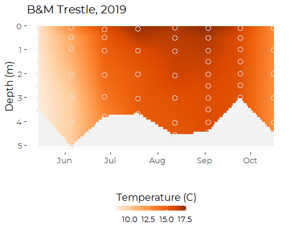

### Salinity

``` r
tmp <- sonde_data %>%
  filter(site == "BMR02", year == 2019)
ptsmooth(tmp, .x  = dt, .y = depth, .val = salinity, 
         .res_x = 1, .res_y = .1,
         y_grow_grid = FALSE, y_with_zero = FALSE) +
geom_point(mapping = aes(dt, depth), data= tmp,
             shape = 21, fill = NA, color = 'gray90', size = 3) +
scale_fill_distiller(palette = 3, direction = 2, 
                        #limits = c(6, 9),
                        na.value = 'gray95',
                                  ) +
  theme_cbep(base_size = 12) +
  theme(legend.position = 'bottom') +
  guides(fill = guide_colorbar(title = 'Salinity (PSU)', 
                               title.position = 'top',
                               barheight = unit(0.2, 'cm'))) +
  
  xlab('') +
  ylab('Depth (m)') +
  ggtitle('B&M Trestle, 2019')
```

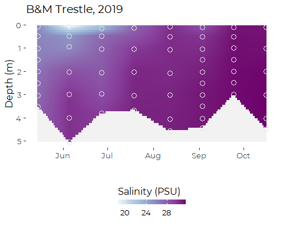

### Oxygen

``` r
tmp <- sonde_data %>%
  filter(site == "BMR02", year == 2019)
ptsmooth(tmp, .x  = dt, .y = depth, .val = do, 
         .res_x = 1, .res_y = .1,
         y_grow_grid = FALSE, y_with_zero = FALSE) +
geom_point(mapping = aes(dt, depth), data= tmp,
             shape = 21, fill = NA, color = 'gray90', size = 3) +
scale_fill_distiller(palette = 4, direction = 2, 
                        #limits = c(6, 9),
                        na.value = 'gray95',
                                  ) +
  theme_cbep(base_size = 12) +
  theme(legend.position = 'bottom') +
  guides(fill = guide_colorbar(title = 'Dissolved Oxygen (mg/l)', 
                               title.position = 'top',
                               barheight = unit(0.2, 'cm'))) +
  
  xlab('') +
  ylab('Depth (m)') +
  ggtitle('B&M Trestle, 2019')
```

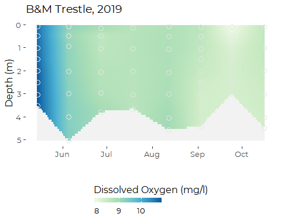

### Percent Saturation

``` r
tmp <- sonde_data %>%
  filter(site == "BMR02", year == 2019)
ptsmooth(tmp, .x  = dt, .y = depth, .val = pctsat, 
         .res_x = 1, .res_y = .1,
         y_grow_grid = FALSE, y_with_zero = FALSE) +
geom_point(mapping = aes(dt, depth), data= tmp,
             shape = 21, fill = NA, color = 'gray90', size = 3) +
scale_fill_distiller(palette = 4, direction = 2, 
                        limits = c(80, 120),
                        na.value = 'gray95',
                                  ) +
  theme_cbep(base_size = 12) +
  theme(legend.position = 'bottom') +
  guides(fill = guide_colorbar(title = 'Percent Saturation', 
                               title.position = 'top',
                               barheight = unit(0.2, 'cm'))) +
  
  xlab('') +
  ylab('Depth (m)') +
  ggtitle('B&M Trestle, 2019')
```

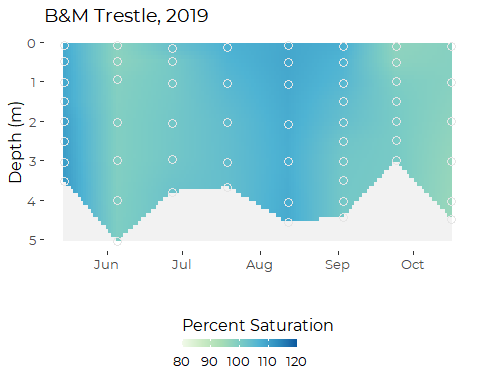

# Fort Gorges

### Temperature

``` r
tmp <- sonde_data %>%
  filter(site == "P6FGG", year == 2018)
ptsmooth(tmp, .x  = dt, .y = depth, .val = temp, 
         .res_x = 1, .res_y = .1,
         y_grow_grid = FALSE, y_with_zero = FALSE) +
geom_point(mapping = aes(dt, depth), data= tmp,
             shape = 21, fill = NA, color = 'gray90', size = 3) +
scale_fill_distiller(palette = 7, direction = 2, 
                        #limits = c(6, 9),
                        na.value = 'gray95',
                                  ) +
  theme_cbep(base_size = 12) +
  theme(legend.position = 'bottom') +
  guides(fill = guide_colorbar(title = 'Temperature (C)', 
                               title.position = 'top',
                               barheight = unit(0.2, 'cm'))) +
  
  xlab('') +
  ylab('Depth (m)') +
  ggtitle('Fort Gorges, 2018')
```

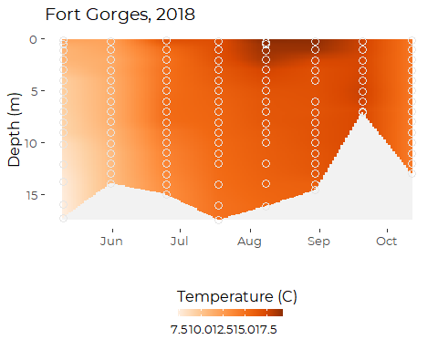

### Salinity

``` r
tmp <- sonde_data %>%
  filter(site == "P6FGG", year == 2018)
ptsmooth(tmp, .x  = dt, .y = depth, .val = salinity, 
         .res_x = 1, .res_y = .1,
         y_grow_grid = FALSE, y_with_zero = FALSE) +
geom_point(mapping = aes(dt, depth), data= tmp,
             shape = 21, fill = NA, color = 'gray90', size = 3) +
scale_fill_distiller(palette = 3, direction = 2, 
                        #limits = c(6, 9),
                        na.value = 'gray95',
                                  ) +
  theme_cbep(base_size = 12) +
  theme(legend.position = 'bottom') +
  guides(fill = guide_colorbar(title = 'Salinity (PSU)', 
                               title.position = 'top',
                               barheight = unit(0.2, 'cm'))) +
  
  xlab('') +
  ylab('Depth (m)') +
  ggtitle('Fort Gorges, 2018')
```

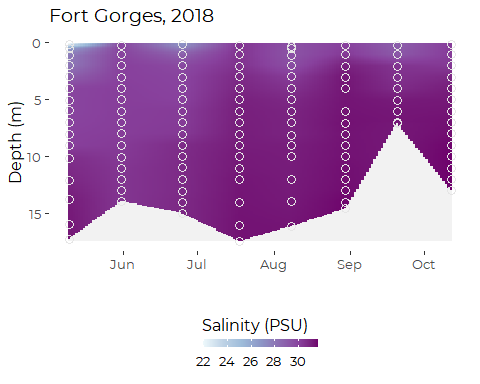

### Dissolved Oxygen

``` r
tmp <- sonde_data %>%
  filter(site == "P6FGG", year == 2018)
ptsmooth(tmp, .x  = dt, .y = depth, .val = do, 
         .res_x = 1, .res_y = .1,
         y_grow_grid = FALSE, y_with_zero = FALSE) +
geom_point(mapping = aes(dt, depth), data= tmp,
             shape = 21, fill = NA, color = 'gray90', size = 3) +
scale_fill_distiller(palette = 4, direction = 2, 
                        limits = c(7, 10),
                        na.value = 'gray95',
                                  ) +
  theme_cbep(base_size = 12) +
  theme(legend.position = 'bottom') +
  guides(fill = guide_colorbar(title = 'Dissolved Oxygen (mg/l)', 
                               title.position = 'top',
                               barheight = unit(0.2, 'cm'))) +
  
  xlab('') +
  ylab('Depth (m)') +
  ggtitle('Fort Gorges, 2018')
```

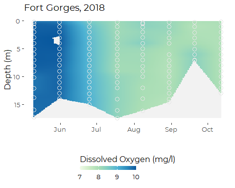

### Percent Saturation

``` r
tmp <- sonde_data %>%
  filter(site == "P6FGG", year == 2018)
ptsmooth(tmp, .x  = dt, .y = depth, .val = pctsat, 
         .res_x = 1, .res_y = .1,
         y_grow_grid = FALSE, y_with_zero = FALSE) +
geom_point(mapping = aes(dt, depth), data= tmp,
             shape = 21, fill = NA, color = 'gray90', size = 3) +
scale_fill_distiller(palette = 4, direction = 2, 
                        #limits = c(6, 9),
                        na.value = 'gray95',
                                  ) +
  theme_cbep(base_size = 12) +
  theme(legend.position = 'bottom') +
  guides(fill = guide_colorbar(title = 'Percent Saturation', 
                               title.position = 'top',
                               barheight = unit(0.2, 'cm'))) +
  
  xlab('') +
  ylab('Depth (m)') +
  ggtitle('Fort Gorges, 2018')
```

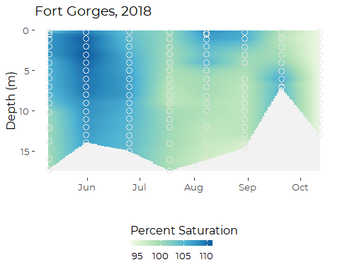

# Presumpscort Estuary Series

It might be worth looking at patterns headed down the Presumpscot
Estuary, as follows:

``` r
presumpscot_transect <- sonde_data %>%
  rename(dates = dt) %>%
  filter(site %in% c('PRV70', 'PR-17', 'PR-28', 'CBPR', 'P6FGG')) %>%
  filter(year == 2018) %>%

  mutate(site = factor(site, 
                       levels = c('PRV70', 'PR-17', 
                                  'PR-28', 'CBPR', 'P6FGG')))
```

## May

``` r
tmp <- presumpscot_transect %>%
  filter(dates == min(dates)) %>%
  mutate(sitenum = as.numeric(site) )
```

### Salinity

``` r
ptsmooth(tmp, .x  = sitenum,  .y  = depth,  .val = salinity, 
         .res_x = 0.01, .res_y = .1,
         y_grow_grid = FALSE, y_with_zero = FALSE) +
  scale_fill_distiller(palette = 3, direction = 2, 
                      limits = c(0, 32),
                      na.value = 'gray95'
                                  ) +
  theme_cbep(base_size = 12) +
  theme(legend.position = 'bottom') +
  guides(fill = guide_colorbar(title = 'Salinity (PSU)', 
                               title.position = 'top',
                               barheight = unit(0.2, 'cm'))) +

  geom_point(mapping = aes(sitenum, depth), data= tmp,
             shape = 21, fill = NA, color = 'gray70', size = 3) +
  scale_x_continuous(breaks = 1:5, 
                     labels = c('PRV70', 'PR-17', 'PR-28', 'CBPR', 'P6FGG')) +
  ylim(5,0) +
  geom_vline(xintercept = 3.05, lty = 2) +
  geom_text(aes(x = 3.25, y = 7, label = "Martin's Point Bridge"), 
            angle = 90, size = 3, hjust = 0) +
  xlab('Site') +
  ylab('Depth (m)') +
  ggtitle('May 2018')
#> Scale for 'y' is already present. Adding another scale for 'y', which will
#> replace the existing scale.
#> Warning: Removed 49323 rows containing missing values (geom_tile).
#> Warning: Removed 10 rows containing missing values (geom_point).
#> Warning: Removed 69373 rows containing missing values (geom_text).
```

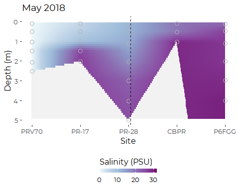

### Temperature

``` r
ptsmooth(tmp, .x  = sitenum,  .y  = depth,  .val = temp, 
         .res_x = 0.01, .res_y = .1,
         y_grow_grid = FALSE, y_with_zero = FALSE) +
  
  scale_fill_distiller(palette = 7, direction = 2, 
                        #limits = c(6, 9),
                        na.value = 'gray95',
                                  ) +
  theme_cbep(base_size = 12) +
  theme(legend.position = 'bottom') +
  guides(fill = guide_colorbar(title = 'Temperature (C)', 
                               title.position = 'top',
                               barheight = unit(0.2, 'cm'))) +
  
  geom_point(mapping = aes(sitenum, depth), data= tmp,
             shape = 21, fill = NA, color = 'gray30', size = 3) +
  scale_x_continuous(breaks = 1:5, 
                     labels = c('PRV70', 'PR-17', 'PR-28', 'CBPR', 'P6FGG')) +
  ylim(5,0) +
  geom_vline(xintercept = 3.05, lty = 2) +
  geom_text(aes(x = 3.2, y = 7, label = "Martin's Point Bridge"), 
            angle = 90, size = 3, hjust = 0) +
  xlab('Site') +
  ylab('Depth (m)') +
  ggtitle('May 2018')
#> Scale for 'y' is already present. Adding another scale for 'y', which will
#> replace the existing scale.
#> Warning: Removed 49323 rows containing missing values (geom_tile).
#> Warning: Removed 10 rows containing missing values (geom_point).
#> Warning: Removed 69373 rows containing missing values (geom_text).
```

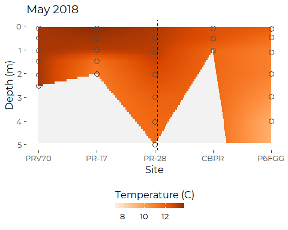

### Dissolved Oxygen

``` r
ptsmooth(tmp, .x  = sitenum,  .y  = depth,  .val = do, 
         .res_x = 0.01, .res_y = .1,
         y_grow_grid = FALSE, y_with_zero = FALSE) +
  scale_fill_distiller(palette = 4, direction = 2, 
                        #limits = c(6, 9),
                        na.value = 'gray95',
                                  ) +
  theme_cbep(base_size = 12) +
  theme(legend.position = 'bottom') +
  guides(fill = guide_colorbar(title = 'Dissolved Oxygen (mg/l)', 
                               title.position = 'top',
                               barheight = unit(0.2, 'cm'))) +
  
  geom_point(mapping = aes(sitenum, depth), data= tmp,
             shape = 21, fill = NA, color = 'gray30', size = 3) +
  scale_x_continuous(breaks = 1:5, 
                     labels = c('PRV70', 'PR-17', 'PR-28', 'CBPR', 'P6FGG')) +
  ylim(5,0) +
  geom_vline(xintercept = 3.05, lty = 2) +
  geom_text(aes(x = 3.25, y = 7, label = "Martin's Point Bridge"), 
            angle = 90, size = 3, hjust = 0) +
  xlab('Site') +
  ylab('Depth (m)') +
  ggtitle('May 2018')
#> Scale for 'y' is already present. Adding another scale for 'y', which will
#> replace the existing scale.
#> Warning: Removed 49323 rows containing missing values (geom_tile).
#> Warning: Removed 10 rows containing missing values (geom_point).
#> Warning: Removed 69373 rows containing missing values (geom_text).
```

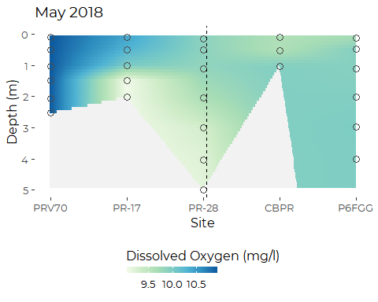

### Chlorophyll

``` r
ptsmooth(tmp, .x  = sitenum,  .y  = depth,  .val = chl_a_sonde, 
         .res_x = 0.01, .res_y = .1,
         y_grow_grid = FALSE, y_with_zero = FALSE) +
  scale_fill_distiller(palette = 5, direction = 2, 
                        #limits = c(6, 9),
                        na.value = 'gray95',
                                  ) +
  theme_cbep(base_size = 12) +
  theme(legend.position = 'bottom') +
  guides(fill = guide_colorbar(title = 'Chlorophyll A (mg/l)', 
                               title.position = 'top',
                               barheight = unit(0.2, 'cm'))) +
  
  geom_point(mapping = aes(sitenum, depth), data= tmp,
             shape = 21, fill = NA, color = 'gray30', size = 3) +
  scale_x_continuous(breaks = 1:5, 
                     labels = c('PRV70', 'PR-17', 'PR-28', 'CBPR', 'P6FGG')) +
  ylim(5,0) + 
  geom_vline(xintercept = 3.05, lty = 2) +
  geom_text(aes(x = 3.25, y = 7, label = "Martin's Point Bridge"), 
            angle = 90, size = 3, hjust = 0) +
  xlab('Site') +
  ylab('Depth (m)') +
  ggtitle('May 2018')
#> Scale for 'y' is already present. Adding another scale for 'y', which will
#> replace the existing scale.
#> Warning: Removed 49323 rows containing missing values (geom_tile).
#> Warning: Removed 10 rows containing missing values (geom_point).
#> Warning: Removed 69373 rows containing missing values (geom_text).
```

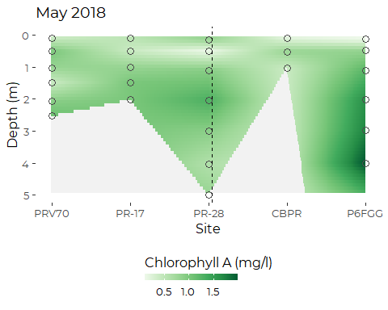

## September

``` r
tmp <- presumpscot_transect %>%
  filter(month == 'Sep') %>%
  mutate(sitenum = as.numeric(site) )
```

### Salinity

``` r
ptsmooth(tmp, .x  = sitenum,  .y  = depth,  .val = salinity, 
         .res_x = 0.01, .res_y = .1,
         y_grow_grid = FALSE, y_with_zero = FALSE) +
  scale_fill_distiller(palette = 3, direction = 2, 
                      limits = c(0, 32),
                      na.value = 'gray95'
                                  ) +
  theme_cbep(base_size = 12) +
  theme(legend.position = 'bottom') +
  guides(fill = guide_colorbar(title = 'Salinity (PSU)', 
                               title.position = 'top',
                               barheight = unit(0.2, 'cm'))) +

  geom_point(mapping = aes(sitenum, depth), data= tmp,
             shape = 21, fill = NA, color = 'gray70', size = 3) +
  scale_x_continuous(breaks = 1:5, 
                     labels = c('PRV70', 'PR-17', 'PR-28', 'CBPR', 'P6FGG')) +
  geom_vline(xintercept = 3.05, lty = 2) +
  geom_text(aes(x = 3.25, y = 7, label = "Martin's Point Bridge"), 
            angle = 90, size = 3, hjust = 0) +
  xlab('Site') +
  ylab('Depth (m)') +
  ggtitle('September 2018')
```

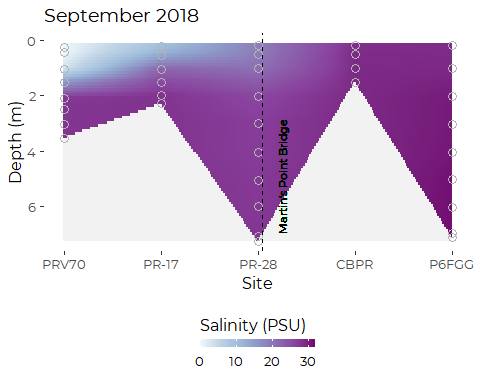

### Temperature, September

``` r
ptsmooth(tmp, .x  = sitenum,  .y  = depth,  .val = temp, 
         .res_x = 0.01, .res_y = .1,
         y_grow_grid = FALSE, y_with_zero = FALSE) +
  
  scale_fill_distiller(palette = 7, direction = 2, 
                        #limits = c(6, 9),
                        na.value = 'gray95',
                                  ) +
  theme_cbep(base_size = 12) +
  theme(legend.position = 'bottom') +
  guides(fill = guide_colorbar(title = 'Temperature (C)', 
                               title.position = 'top',
                               barheight = unit(0.2, 'cm'))) +
  
  geom_point(mapping = aes(sitenum, depth), data= tmp,
             shape = 21, fill = NA, color = 'gray30', size = 3) +
  scale_x_continuous(breaks = 1:5, 
                     labels = c('PRV70', 'PR-17', 'PR-28', 'CBPR', 'P6FGG')) +
  geom_vline(xintercept = 3.05, lty = 2) +
  geom_text(aes(x = 3.2, y = 7, label = "Martin's Point Bridge"), 
            angle = 90, size = 3, hjust = 0) +
  xlab('Site') +
  ylab('Depth (m)') +
  ggtitle('September 2018')
```

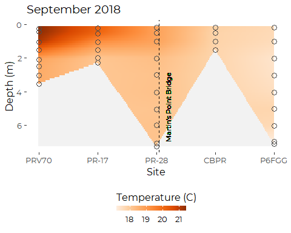

### Salinity, September

``` r
ptsmooth(tmp, .x  = sitenum,  .y  = depth,  .val = salinity, 
         .res_x = 0.01, .res_y = .1,
         y_grow_grid = FALSE, y_with_zero = FALSE) +
  scale_fill_distiller(palette = 3, direction = 2, 
                      limits = c(0, 32),
                      na.value = 'gray95'
                                  ) +
  theme_cbep(base_size = 12) +
  theme(legend.position = 'bottom') +
  guides(fill = guide_colorbar(title = 'Salinity (PSU)', 
                               title.position = 'top',
                               barheight = unit(0.2, 'cm'))) +

  geom_point(mapping = aes(sitenum, depth), data= tmp,
             shape = 21, fill = NA, color = 'gray70', size = 3) +
  scale_x_continuous(breaks = 1:5, 
                     labels = c('PRV70', 'PR-17', 'PR-28', 'CBPR', 'P6FGG')) +
  geom_vline(xintercept = 3.05, lty = 2) +
  geom_text(aes(x = 3.25, y = 7, label = "Martin's Point Bridge"), 
            angle = 90, size = 3, hjust = 0) +
  xlab('Site') +
  ylab('Depth (m)') +
  ggtitle('September 2018')
```


### Dissolved Oxygen, September

``` r
ptsmooth(tmp, .x  = sitenum,  .y  = depth,  .val = do, 
         .res_x = 0.01, .res_y = .1,
         y_grow_grid = FALSE, y_with_zero = FALSE) +
  scale_fill_distiller(palette = 4, direction = 2, 
                        limits = c(6, 9),
                        na.value = 'gray95',
                                  ) +
  theme_cbep(base_size = 12) +
  theme(legend.position = 'bottom') +
  guides(fill = guide_colorbar(title = 'Dissolved Oxygen (mg/l)', 
                               title.position = 'top',
                               barheight = unit(0.2, 'cm'))) +
  
  geom_point(mapping = aes(sitenum, depth), data= tmp,
             shape = 21, fill = NA, color = 'gray30', size = 3) +
  scale_x_continuous(breaks = 1:5, 
                     labels = c('PRV70', 'PR-17', 'PR-28', 'CBPR', 'P6FGG')) +
  geom_vline(xintercept = 3.05, lty = 2) +
  geom_text(aes(x = 3.25, y = 7, label = "Martin's Point Bridge"), 
            angle = 90, size = 3, hjust = 0) +
  xlab('Site') +
  ylab('Depth (m)') +
  ggtitle('September 2018')
```

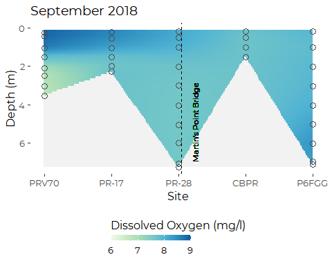

### Chlorophyll

``` r
ptsmooth(tmp, .x  = sitenum,  .y  = depth,  .val = chl_a_sonde, 
         .res_x = 0.01, .res_y = .1,
         y_grow_grid = FALSE, y_with_zero = FALSE) +
  scale_fill_distiller(palette = 5, direction = 2, 
                        #limits = c(6, 9),
                        na.value = 'gray95',
                                  ) +
  theme_cbep(base_size = 12) +
  theme(legend.position = 'bottom') +
  guides(fill = guide_colorbar(title = 'Chlorophyll A (mg/l)', 
                               title.position = 'top',
                               barheight = unit(0.2, 'cm'))) +
  
  geom_point(mapping = aes(sitenum, depth), data= tmp,
             shape = 21, fill = NA, color = 'gray30', size = 3) +
  scale_x_continuous(breaks = 1:5, 
                     labels = c('PRV70', 'PR-17', 'PR-28', 'CBPR', 'P6FGG')) +
  geom_vline(xintercept = 3.05, lty = 2) +
  geom_text(aes(x = 3.25, y = 7, label = "Martin's Point Bridge"), 
            angle = 90, size = 3, hjust = 0) +
  xlab('Site') +
  ylab('Depth (m)') +
  ggtitle('September 2018')
```

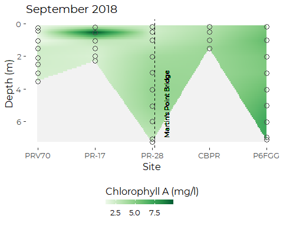

# Royal Estuary Series

A transect on the Royal Estuary.

``` r
rr_transect
#> [1] "RR-01" "RR-06" "RR-13" "RR-19" "RR-20"
```

``` r
royal_transect <- sonde_data %>%
  rename(dates = dt) %>%
  filter(site %in% rr_transect) %>%
  filter(year == 2017) %>%
  mutate(site = factor(site, 
                       levels = rr_transect))
```

## May

``` r
tmp <- royal_transect %>%
  filter(dates == min(dates)) %>%
  mutate(sitenum = as.numeric(site) )
```

### Temperature

``` r
ptsmooth(tmp, .x  = sitenum,  .y  = depth,  .val = temp, 
         .res_x = 0.01, .res_y = .1,
         y_grow_grid = FALSE, y_with_zero = FALSE) +
  scale_fill_distiller(palette = 7, direction = 2, 
                      limits = c(11, 14),
                      na.value = 'gray95'
                                  ) +
  theme_cbep(base_size = 12) +
  theme(legend.position = 'bottom') +
  guides(fill = guide_colorbar(title = 'Temperature (C)', 
                               title.position = 'top',
                               barheight = unit(0.2, 'cm'))) +

  geom_point(mapping = aes(sitenum, depth), data= tmp,
             shape = 21, fill = NA, color = 'gray70', size = 3) +
  scale_x_continuous(breaks = 1:5, 
                     labels = levels(royal_transect$site)) +
  xlab('Site') +
  ylab('Depth (m)') +
  ggtitle('May 2018')
```

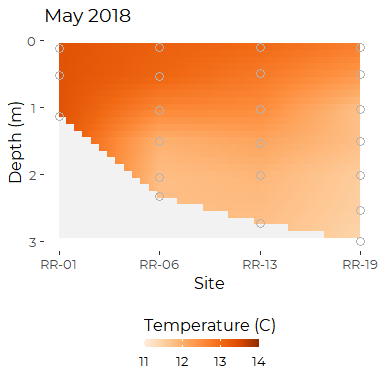

### Salinity

``` r
ptsmooth(tmp, .x  = sitenum,  .y  = depth,  .val = salinity, 
         .res_x = 0.01, .res_y = .1,
         y_grow_grid = FALSE, y_with_zero = FALSE) +
  scale_fill_distiller(palette = 3, direction = 2, 
                      limits = c(0, 32),
                      na.value = 'gray95'
                                  ) +
  theme_cbep(base_size = 12) +
  theme(legend.position = 'bottom') +
  guides(fill = guide_colorbar(title = 'Salinity (PSU)', 
                               title.position = 'top',
                               barheight = unit(0.2, 'cm'))) +

  geom_point(mapping = aes(sitenum, depth), data= tmp,
             shape = 21, fill = NA, color = 'gray70', size = 3) +
  scale_x_continuous(breaks = 1:5, 
                     labels = levels(royal_transect$site)) +
  xlab('Site') +
  ylab('Depth (m)') +
  ggtitle('May 2018')
```

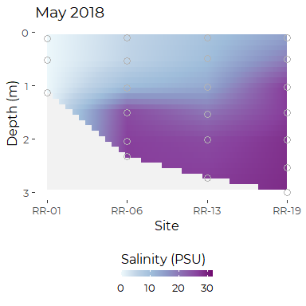
\#\#\# Dissolved Oxygen

``` r
ptsmooth(tmp, .x  = sitenum,  .y  = depth,  .val = do, 
         .res_x = 0.01, .res_y = .1,
         y_grow_grid = FALSE, y_with_zero = FALSE) +
  scale_fill_distiller(palette = 4, direction = 2, 
                        limits = c(6, 11),
                        na.value = 'gray95',
                                  ) +
  theme_cbep(base_size = 12) +
  theme(legend.position = 'bottom') +
  guides(fill = guide_colorbar(title = 'Dissolved Oxygen (mg/l)', 
                               title.position = 'top',
                               barheight = unit(0.2, 'cm'))) +
  
  geom_point(mapping = aes(sitenum, depth), data= tmp,
             shape = 21, fill = NA, color = 'gray30', size = 3) +
  scale_x_continuous(breaks = 1:5, 
                     labels = levels(royal_transect$site)) +
  xlab('Site') +
  ylab('Depth (m)') +
  ggtitle('May 2018')
```

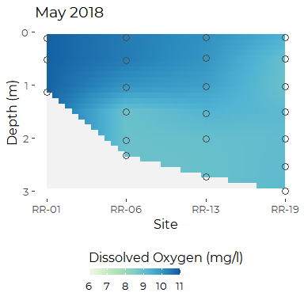

### Chlorophyll

``` r
ptsmooth(tmp, .x  = sitenum,  .y  = depth,  .val = chl_a_sonde, 
         .res_x = 0.01, .res_y = .1,
         y_grow_grid = FALSE, y_with_zero = FALSE) +
  scale_fill_distiller(palette = 5, direction = 2, 
                        #limits = c(6, 9),
                        na.value = 'gray95',
                                  ) +
  theme_cbep(base_size = 12) +
  theme(legend.position = 'bottom') +
  guides(fill = guide_colorbar(title = 'Chlorophyll A (mg/l)', 
                               title.position = 'top',
                               barheight = unit(0.2, 'cm'))) +
  
  geom_point(mapping = aes(sitenum, depth), data= tmp,
             shape = 21, fill = NA, color = 'gray30', size = 3) +
  scale_x_continuous(breaks = 1:5, 
                     labels = levels(royal_transect$site)) +
  xlab('Site') +
  ylab('Depth (m)') +
  ggtitle('MAy 2018')
```

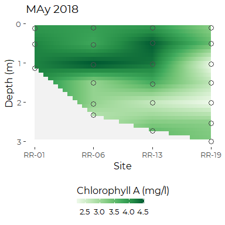

## September

``` r
tmp <- royal_transect %>%
  filter(month == 'Sep') %>%
  mutate(sitenum = as.numeric(site) )
```

### Temperature

``` r
ptsmooth(tmp, .x  = sitenum,  .y  = depth,  .val = temp, 
         .res_x = 0.01, .res_y = .1,
         y_grow_grid = FALSE, y_with_zero = FALSE) +
  
  scale_fill_distiller(palette = 7, direction = 2, 
                        limits = c(16, 19),
                        na.value = 'gray95',
                                  ) +
  theme_cbep(base_size = 12) +
  theme(legend.position = 'bottom') +
  guides(fill = guide_colorbar(title = 'Temperature (C)', 
                               title.position = 'top',
                               barheight = unit(0.2, 'cm'))) +
  
  geom_point(mapping = aes(sitenum, depth), data= tmp,
             shape = 21, fill = NA, color = 'gray30', size = 3) +
 scale_x_continuous(breaks = 1:5, 
                     labels = levels(royal_transect$site)) +
  geom_vline(xintercept = 3.05, lty = 2) +
  xlab('Site') +
  ylab('Depth (m)') +
  ggtitle('September 2018')
```

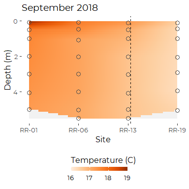

### Salinity

``` r
ptsmooth(tmp, .x  = sitenum,  .y  = depth,  .val = salinity, 
         .res_x = 0.01, .res_y = .1,
         y_grow_grid = FALSE, y_with_zero = FALSE) +
  scale_fill_distiller(palette = 3, direction = 2, 
                      limits = c(0, 32),
                      na.value = 'gray95'
                                  ) +
  theme_cbep(base_size = 12) +
  theme(legend.position = 'bottom') +
  guides(fill = guide_colorbar(title = 'Salinity (PSU)', 
                               title.position = 'top',
                               barheight = unit(0.2, 'cm'))) +

  geom_point(mapping = aes(sitenum, depth), data= tmp,
             shape = 21, fill = NA, color = 'gray70', size = 3) +
  scale_x_continuous(breaks = 1:5, 
                     labels = levels(royal_transect$site)) +
  xlab('Site') +
  ylab('Depth (m)') +
  ggtitle('September 2018')
```

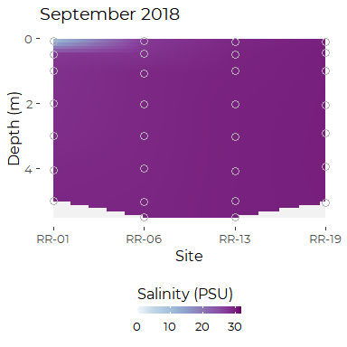

### Dissolved Oxygen

``` r
ptsmooth(tmp, .x  = sitenum,  .y  = depth,  .val = do, 
         .res_x = 0.01, .res_y = .1,
         y_grow_grid = FALSE, y_with_zero = FALSE) +
  scale_fill_distiller(palette = 4, direction = 2, 
                        limits = c(6, 11),
                        na.value = 'gray95',
                                  ) +
  theme_cbep(base_size = 12) +
  theme(legend.position = 'bottom') +
  guides(fill = guide_colorbar(title = 'Dissolved Oxygen (mg/l)', 
                               title.position = 'top',
                               barheight = unit(0.2, 'cm'))) +
  
  geom_point(mapping = aes(sitenum, depth), data= tmp,
             shape = 21, fill = NA, color = 'gray30', size = 3) +
  scale_x_continuous(breaks = 1:5, 
                     labels = levels(royal_transect$site)) +
  xlab('Site') +
  ylab('Depth (m)') +
  ggtitle('September 2018')
```


### Chlorophyll

``` r
ptsmooth(tmp, .x  = sitenum,  .y  = depth,  .val = chl_a_sonde, 
         .res_x = 0.01, .res_y = .1,
         y_grow_grid = FALSE, y_with_zero = FALSE) +
  scale_fill_distiller(palette = 5, direction = 2, 
                        #limits = c(6, 9),
                        na.value = 'gray95',
                                  ) +
  theme_cbep(base_size = 12) +
  theme(legend.position = 'bottom') +
  guides(fill = guide_colorbar(title = 'Chlorophyll A (mg/l)', 
                               title.position = 'top',
                               barheight = unit(0.2, 'cm'))) +
  
  geom_point(mapping = aes(sitenum, depth), data= tmp,
             shape = 21, fill = NA, color = 'gray30', size = 3) +
  scale_x_continuous(breaks = 1:5, 
                     labels = levels(royal_transect$site)) +
  xlab('Site') +
  ylab('Depth (m)') +
  ggtitle('September 2018')
```

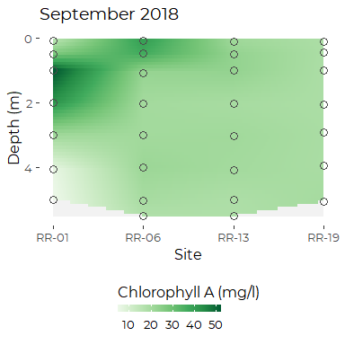
